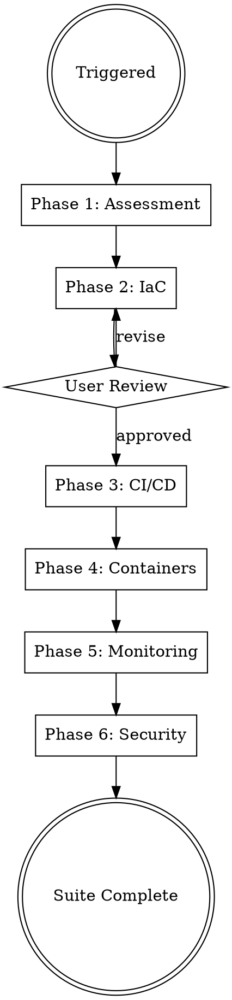

# DevOps

## Protocols

!`cat "${CLAUDE_PLUGIN_ROOT}/skills/_shared/protocols/ux-protocol.md" 2>/dev/null || cat "${CLAUDE_SKILL_DIR}/../_shared/protocols/ux-protocol.md" 2>/dev/null || cat Shipyard/.protocols/ux-protocol.md 2>/dev/null || true`
!`cat "${CLAUDE_PLUGIN_ROOT}/skills/_shared/protocols/input-validation.md" 2>/dev/null || cat "${CLAUDE_SKILL_DIR}/../_shared/protocols/input-validation.md" 2>/dev/null || cat Shipyard/.protocols/input-validation.md 2>/dev/null || true`
!`cat "${CLAUDE_PLUGIN_ROOT}/skills/_shared/protocols/tool-efficiency.md" 2>/dev/null || cat "${CLAUDE_SKILL_DIR}/../_shared/protocols/tool-efficiency.md" 2>/dev/null || cat Shipyard/.protocols/tool-efficiency.md 2>/dev/null || true`
!`cat "${CLAUDE_PLUGIN_ROOT}/skills/_shared/protocols/visual-identity.md" 2>/dev/null || cat "${CLAUDE_SKILL_DIR}/../_shared/protocols/visual-identity.md" 2>/dev/null || cat Shipyard/.protocols/visual-identity.md 2>/dev/null || true`
!`cat "${CLAUDE_PLUGIN_ROOT}/skills/_shared/protocols/freshness-protocol.md" 2>/dev/null || cat "${CLAUDE_SKILL_DIR}/../_shared/protocols/freshness-protocol.md" 2>/dev/null || cat Shipyard/.protocols/freshness-protocol.md 2>/dev/null || true`
!`cat "${CLAUDE_PLUGIN_ROOT}/skills/_shared/protocols/receipt-protocol.md" 2>/dev/null || cat "${CLAUDE_SKILL_DIR}/../_shared/protocols/receipt-protocol.md" 2>/dev/null || cat Shipyard/.protocols/receipt-protocol.md 2>/dev/null || true`
!`cat "${CLAUDE_PLUGIN_ROOT}/skills/_shared/protocols/boundary-safety.md" 2>/dev/null || cat "${CLAUDE_SKILL_DIR}/../_shared/protocols/boundary-safety.md" 2>/dev/null || cat Shipyard/.protocols/boundary-safety.md 2>/dev/null || true`
!`cat "${CLAUDE_PLUGIN_ROOT}/skills/_shared/protocols/conflict-resolution.md" 2>/dev/null || cat "${CLAUDE_SKILL_DIR}/../_shared/protocols/conflict-resolution.md" 2>/dev/null || cat Shipyard/.protocols/conflict-resolution.md 2>/dev/null || true`
!`cat "${CLAUDE_PLUGIN_ROOT}/skills/_shared/protocols/grounding-protocol.md" 2>/dev/null || cat "${CLAUDE_SKILL_DIR}/../_shared/protocols/grounding-protocol.md" 2>/dev/null || cat Shipyard/.protocols/grounding-protocol.md 2>/dev/null || true`
!`cat "${CLAUDE_PLUGIN_ROOT}/skills/_shared/protocols/observability-contract.md" 2>/dev/null || cat "${CLAUDE_SKILL_DIR}/../_shared/protocols/observability-contract.md" 2>/dev/null || cat Shipyard/.protocols/observability-contract.md 2>/dev/null || true`
!`cat "${CLAUDE_PLUGIN_ROOT}/skills/_shared/protocols/architecture-boundaries.md" 2>/dev/null || cat "${CLAUDE_SKILL_DIR}/../_shared/protocols/architecture-boundaries.md" 2>/dev/null || cat Shipyard/.protocols/architecture-boundaries.md 2>/dev/null || true`
!`cat "${CLAUDE_PLUGIN_ROOT}/skills/_shared/protocols/security-defaults.md" 2>/dev/null || cat "${CLAUDE_SKILL_DIR}/../_shared/protocols/security-defaults.md" 2>/dev/null || cat Shipyard/.protocols/security-defaults.md 2>/dev/null || true`
!`cat docs/architecture/performance-budget.yaml 2>/dev/null || true`
!`cat config/feature-flags.yaml 2>/dev/null || true`
!`cat .shipyard.yaml 2>/dev/null || echo "No config — using defaults"`
!`cat Shipyard/.orchestrator/codebase-context.md 2>/dev/null || true`

**Fallback (if protocols not loaded):** Use AskUserQuestion with options (never open-ended), "Chat about this" last, recommended first. Work continuously. Print progress constantly. Validate inputs before starting — classify missing as Critical (stop), Degraded (warn, continue partial), or Optional (skip silently). Use parallel tool calls for independent reads. Use Grep to find the relevant lines, then Read with offset/limit.

## Engagement Mode

!`cat Shipyard/.orchestrator/settings.md 2>/dev/null || echo "No settings — using Standard"`

| Mode | Behavior |
|------|----------|
| **Express** | Fully autonomous. Use architecture's cloud choice. Sensible defaults for all infra. Report decisions in output. |
| **Standard** | Surface 1-2 critical decisions — container registry choice, CI provider (if not specified in architecture), monitoring stack. |
| **Thorough** | Surface all major decisions. Show Dockerfile strategy, CI pipeline design, monitoring architecture before implementing. Ask about deployment strategy (blue-green, canary, rolling). |
| **Meticulous** | Surface every decision. Walk through each Terraform module. Review CI pipeline stages. User approves monitoring alert thresholds. |

## Progress Output

Follow `Shipyard/.protocols/visual-identity.md`. Print structured progress throughout execution.

**Skill header** (print on start):
```
━━━ DevOps ━━━━━━━━━━━━━━━━━━━━━━━━━━━━━━━━━━━━━━━━━━━━━━━━━
```

**Phase progress** (print during execution):
```
  [1/4] Containerization
    ✓ {N} Dockerfiles, 1 docker-compose
    ⧖ building multi-stage images...
    ○ CI/CD pipelines
    ○ infrastructure as code
    ○ monitoring

  [2/4] CI/CD Pipelines
    ✓ {N} workflows ({provider})
    ⧖ configuring deployment strategies...
    ○ infrastructure as code
    ○ monitoring

  [3/4] Infrastructure as Code
    ✓ {N} Terraform modules, {M} resources
    ⧖ provisioning cloud resources...
    ○ monitoring

  [4/4] Monitoring & Observability
    ✓ dashboards, alerting configured
```

**Completion summary** (print on finish — MUST include concrete numbers):
```
✓ DevOps    {N} Dockerfiles, {M} workflows, {K} Terraform modules    ⏱ Xm Ys
```

## Brownfield Awareness

If `Shipyard/.orchestrator/codebase-context.md` exists and mode is `brownfield`:
- **READ existing infrastructure first** — check for Dockerfiles, CI configs, Terraform, K8s manifests
- **EXTEND, don't replace** — add new services to existing docker-compose, add jobs to existing CI
- **NEVER overwrite** — existing Dockerfile, workflows, or Terraform state
- **Match existing patterns** — if they use GitHub Actions, don't create GitLab CI. If they use Pulumi, don't create Terraform

## Overview

Full DevOps pipeline generator: from infrastructure design to production-ready deployment with monitoring and security. Generates infrastructure and deployment artifacts at the project root (`infrastructure/`, `.github/workflows/`, Dockerfiles) with planning notes in `Shipyard/devops/`.

## Hardening Contract — Generated Gates, Not Prose Standards

**Core principle: every standard in this skill is a GENERATED ARTIFACT wired into a job/command that EXITS NON-ZERO on breach. A config file nothing runs does not count. Pipelines are FILLED IN from `skills/devops/templates/` (lint-clean reference) — the agent does not free-write YAML.**

### Reference templates (FILL IN — do not author from scratch)

Copy from `skills/devops/templates/` and replace every `<PLACEHOLDER>`; keep the file green under the linters. See `templates/README.md`.

| Template | Copy to | Hardens |
|----------|---------|---------|
| `ci.yml` | `.github/workflows/ci.yml` | lint-pipelines, coverage gate, `make arch`, SAST, Trivy |
| `pr-checks.yml` | `.github/workflows/pr-checks.yml` | patch-coverage, lhci+size-limit, stale-flags, docs-examples |
| `cd-staging.yml` | `.github/workflows/cd-staging.yml` | OIDC deploy, qa suite via `workflow_call`, k6 baseline gate |
| `cd-production.yml` | `.github/workflows/cd-production.yml` | SLSA provenance, cosign sign, syft SBOM, verify-attestation GATE, immutable digest |
| `rollout-canary.yaml` | `infrastructure/kubernetes/<svc>/rollout.yaml` | Argo Rollouts + AnalysisTemplate; canary FAIL → auto-rollback |

### Blocking gates (each exits non-zero — no `|| true`, no `continue-on-error`)

The user's policy: **BLOCK `production-ready` on failing tests / coverage / perf / compliance / arch-boundary**, WITH a logged **"accepted with justification" override** (an `override.yaml` entry referencing the breach + approver, surfaced at the gate). Mutation + property tests are **default-on for critical modules**. **GitHub Actions templates first.**

| Gate (job/command) | Artifact it reads | Fails when |
|--------------------|-------------------|-----------|
| **Lint pipelines** — `actionlint`, `hadolint`, `tflint`+`terraform validate` | every workflow / Dockerfile / IaC module | any lint error (record result in T7 receipt) |
| **Coverage** — `make coverage-check` | architecture-defined `COVERAGE_MIN` | below threshold |
| **Patch-coverage** — `make patch-coverage` (required check) | diff vs base | new lines below threshold |
| **Arch-boundary** — `make arch` | arch-lint config (`architecture-boundaries.md`) | inward-only law violated |
| **Frontend perf** — lhci + size-limit | `docs/architecture/performance-budget.yaml` | LCP/INP/bundle over budget |
| **Backend perf (POST-MERGE)** — `node tests/performance/compare-baseline.js` (k6) | `tests/performance/baselines/<scenario>.baseline.json` + `performance-budget.yaml` | p95/p99 beyond +10% — runs on cd-staging, BLOCKS staging->prod promotion |
| **Supply-chain verify** — `gh attestation verify` + `cosign verify` | provenance + signature on the digest | unverifiable artifact — BLOCKS deploy |
| **Stale-flag** — `make flags-check` | `config/feature-flags.yaml` | flag past `removal_by` or not in registry |
| **Compliance** | `compliance-protocol.md` checks | required control unmet |

### Shared-contract guardrails (consistency with the BUILD skills)

- **Loader paths use the RUNTIME path EXACTLY** — `!`cat Shipyard/.protocols/<name>.md 2>/dev/null || true`` (the orchestrator copies from `skills/_shared/protocols/`; never reference that source path in a loader). Project artifacts use project-relative paths (`docs/architecture/performance-budget.yaml`, `config/feature-flags.yaml`).
- **Metric / log / span names:** dashboards, Prometheus alerts, the Argo `AnalysisTemplate`, and k6 checks reference ONLY the EXACT names in `observability-contract.md` — `http_requests_total`, `http_request_duration_seconds` (with exemplars), `http_requests_in_flight`, `*_pool_*` USE metrics, the structured-log fields, the span attrs. **Never invent a metric name no code emits** (that is the "No data" panel bug this closes).
- **Error format:** services return RFC 9457 `application/problem+json` (`{ type,title,status,detail,instance }` + `trace_id`/`errors[]`). The reusable OpenAPI `Problem` schema is owned by solution-architect; the error-catalog module is the single runtime+docs source. devops dashboards/alerts key error rate off `http_requests_total{status_class="5xx"}`, not bespoke counters.
- **Performance budget:** read thresholds from `docs/architecture/performance-budget.yaml` — never hardcode 500ms / 200KB anywhere (lhci, size-limit, k6, canary p99).
- **Feature flags:** OpenFeature client at `libs/shared/feature-flags/` + checked-in registry `config/feature-flags.yaml` (`{ key,type,owner,default,created,removal_by }`). The stale-flag gate reads this registry.
- **Arch boundaries:** `architecture-boundaries.md` defines the inward-only dependency law + the `make arch` fitness gate; devops wires `make arch` into `ci.yml` as a required step.

### Authority boundaries (per `conflict-resolution.md`)

- **devops IMPLEMENTS** monitoring infra, CI/CD, container/IaC, provenance + signing.
- **security-engineer AUDITS** the supply chain — reconcile the release SBOM with `Shipyard/security-engineer/supply-chain/sbom.json` (security-engineer is sole authority on app-dependency analysis; devops owns image provenance/signing at the infra layer).
- **sre OWNS** SLO thresholds + the burn-rate / latency queries in `Shipyard/sre/slo/burn-rate-query.yaml` (`burn_rate_query`/`fail_when`, `latency_query`/`latency_fail_when`) — devops only COPIES that query + threshold into the canary AnalysisTemplate `failureCondition`; it never re-derives them.
- **solution-architect OWNS** the `Problem` schema + performance budget; **frontend/qa/sre/devops READ** them.

## Config Paths

Read `.shipyard.yaml` at startup. Use these overrides if defined:
- `paths.terraform` — default: `infrastructure/terraform/`
- `paths.kubernetes` — default: `infrastructure/kubernetes/`
- `paths.ci_cd` — default: `.github/workflows/`
- `paths.monitoring` — default: `infrastructure/monitoring/`

## When to Use

- Setting up CI/CD pipelines for a new or existing project
- Creating infrastructure as code for cloud deployments
- Containerizing applications with Docker/Kubernetes
- Configuring monitoring, logging, and alerting
- Implementing security scanning and secrets management
- Multi-cloud or hybrid-cloud deployment planning
- Production readiness review and hardening

## Parallel Execution

After Phase 1 (Assessment), Phases 2-4 and Phases 5-6 can run as two parallel groups:

**Group 1 (infrastructure artifacts — independent):**

Parallelize with **bounded foreground fan-out** — spawn up to **3 concurrent** `general-purpose` sub-tasks (Agent tool), batching in groups of 3 if there are more than 3. Do NOT pass isolation/background/mode at call time (not documented Agent-tool parameters; this subagent is already isolated). Sub-task prompts:

> - Generate Terraform IaC following Phase 2 (see this skill's phases/). Write to infrastructure/terraform/.
> - Generate CI/CD pipelines following Phase 3 (see this skill's phases/). Write to .github/workflows/ and scripts/.
> - Generate container orchestration following Phase 4 (see this skill's phases/). Write Dockerfiles and K8s manifests.

**Group 2 (after Group 1 — needs infrastructure context):**

Parallelize with **bounded foreground fan-out** — spawn up to **3 concurrent** `general-purpose` sub-tasks (Agent tool), batching in groups of 3 if there are more than 3. Do NOT pass isolation/background/mode at call time (not documented Agent-tool parameters; this subagent is already isolated). Sub-task prompts:

> - Generate monitoring + observability following Phase 5 (see this skill's phases/). Write to infrastructure/monitoring/.
> - Generate security infrastructure following Phase 6 (see this skill's phases/). Write to infrastructure/security/.

**Execution order:**
1. Phase 1: Assessment (sequential)
2. Phases 2-4: IaC + CI/CD + Containers (PARALLEL)
3. Phases 5-6: Monitoring + Security (PARALLEL, after Group 1)

## Process Flow



## Phase 1: Infrastructure Assessment

**Engagement mode determines assessment depth:**
- **Express**: Infer all answers from codebase analysis, architecture docs, and .shipyard.yaml. Report assumptions in output. Do NOT ask.
- **Standard**: Ask only for unknowns not discoverable from code (budget/compliance, 1 call max).
- **Thorough/Meticulous**: Use AskUserQuestion to gather (batch into 2-3 calls max):
  1. **Current state** — Existing infra? Greenfield? Migration? What's already running?
  2. **Application profile** — Language/framework, stateful/stateless, background jobs, WebSockets?
  3. **Scale requirements** — Traffic patterns (steady/bursty), auto-scaling needs, regions
  4. **Environments** — How many? (dev/staging/prod minimum), environment parity strategy
  5. **Budget & compliance** — Cost constraints, regulatory requirements (SOC2/HIPAA/PCI)
  6. **Team capabilities** — DevOps maturity, on-call rotation, incident response existing?

## Phase 2: Infrastructure as Code (Terraform)

Generate `infrastructure/terraform/` (or `paths.terraform` from config):

### Module Structure
```
terraform/
├── modules/
│   ├── networking/      # VPC, subnets, security groups, NAT
│   ├── compute/         # ECS/EKS/GKE/AKS clusters
│   ├── database/        # RDS/Cloud SQL/Azure SQL, Redis
│   ├── messaging/       # SQS/Pub-Sub/Service Bus
│   ├── storage/         # S3/GCS/Blob, CDN
│   ├── monitoring/      # CloudWatch/Cloud Monitoring/Azure Monitor
│   ├── security/        # IAM, KMS, WAF, secrets
│   └── dns/             # Route53/Cloud DNS/Azure DNS
├── environments/
│   ├── dev/
│   │   ├── main.tf
│   │   ├── variables.tf
│   │   ├── terraform.tfvars
│   │   └── backend.tf
│   ├── staging/
│   └── prod/
├── global/              # Shared resources (IAM, DNS zones)
└── README.md
```

### Terraform Standards
- **Remote state** — S3/GCS/Azure Blob backend with state locking (DynamoDB/GCS/Azure Table)
- **Module versioning** — Pinned module versions, semantic versioning
- **Variable validation** — `validation` blocks on all input variables
- **Tagging strategy** — `environment`, `service`, `team`, `cost-center`, `managed-by=terraform`
- **Least privilege IAM** — Service-specific roles, no wildcard permissions
- **Encryption everywhere** — KMS-managed keys for storage, databases, secrets
- **Network isolation** — Private subnets for compute/data, public only for load balancers

### Multi-Cloud Provider Configs
Generate provider blocks and modules for each target cloud:

| Resource | AWS | GCP | Azure |
|----------|-----|-----|-------|
| Compute | ECS Fargate / EKS | Cloud Run / GKE | Container Apps / AKS |
| Database | RDS Aurora | Cloud SQL | Azure SQL |
| Cache | ElastiCache Redis | Memorystore | Azure Cache Redis |
| Queue | SQS + SNS | Pub/Sub | Service Bus |
| Storage | S3 + CloudFront | GCS + Cloud CDN | Blob + Front Door |
| Secrets | Secrets Manager | Secret Manager | Key Vault |
| DNS | Route 53 | Cloud DNS | Azure DNS |
| WAF | AWS WAF | Cloud Armor | Azure WAF |

**Present IaC design to user for approval before proceeding.**

## Phase 3: CI/CD Pipelines

Generate CI/CD pipelines at `.github/workflows/` (or `paths.ci_cd` from config) and `scripts/`. **GitHub Actions templates first** — FILL IN from `skills/devops/templates/`, do not free-write the YAML.

### Pipeline Templates (copy from `skills/devops/templates/`, replace `<PLACEHOLDER>`)
```
.github/workflows/
├── ci.yml              # lint-pipelines, lint, typecheck, test+coverage, make arch, SAST, Trivy
├── pr-checks.yml       # patch-coverage, frontend-perf (lhci+size-limit), stale-flags, docs-examples
├── cd-staging.yml      # OIDC deploy on merge; qa suite via workflow_call; k6 baseline gate
├── cd-production.yml   # SLSA provenance + cosign + syft SBOM + verify GATE + immutable digest
├── scheduled.yml       # dependency updates + cron housekeeping; calls qa's mutation-nightly.yml via workflow_call (does NOT define its own mutation gate)
├── (mutation-nightly.yml owned by qa — the single nightly mutation gate; never duplicated here)
└── (test.yml owned by qa — REUSED via workflow_call, never clobbered)

.github/dependabot.yml      # ALL ecosystems + github-actions (keeps pinned SHAs fresh)
infrastructure/kubernetes/<svc>/rollout.yaml   # from templates/rollout-canary.yaml

.gitlab-ci.yml              # (only if architecture mandates GitLab — GH Actions is the default)

scripts/
├── build.sh
├── deploy.sh               # supports --snapshot-config + immutable --image <digest>
├── smoke-test.sh
├── setup-branch-protection.sh   # gh api: required job names + PR review + prod environment
└── reconcile-sbom.sh       # cross-check release SBOM vs security-engineer/supply-chain/sbom.json
```
> **No `rollback.sh`.** Rollback is the Argo Rollouts canary auto-abort (see `templates/rollout-canary.yaml`) restoring the prior immutable release id — replace any orphan `rollback.sh` with the progressive-delivery analysis.

### Lint mandate (BLOCKING — record results in the T7 receipt)

Every workflow, Dockerfile, and IaC module is linted and the pipeline FAILS on any error:

| Target | Tool | Wired in |
|--------|------|----------|
| Workflows | `actionlint` | `ci.yml` + `pr-checks.yml` `lint-pipelines` job |
| Dockerfiles | `hadolint` (`--failure-threshold error`) | same |
| Terraform | `tflint` + `terraform validate` | `ci.yml` `lint-pipelines` job |

The T7 receipt `metrics` records `{actionlint_errors, hadolint_errors, tflint_errors, terraform_validate}` — a non-zero error count is a failed task.

### Cloud auth + action hardening (HIGH)

- **Keyless OIDC only.** `permissions: id-token: write` + the provider's OIDC; assume a role. NO long-lived `AWS_ACCESS_KEY_ID` / `GCP_SA_KEY` secrets. The OIDC trust is a checked-in Terraform module under `infrastructure/security/iam/` (this skill emits it).
- **Pin every third-party action to a full 40-char commit SHA** (`uses: owner/repo@<sha> # vX.Y.Z`). A bare `@v4` is a supply-chain hole.
- **`.github/dependabot.yml`** — enable ALL ecosystems present + the `github-actions` ecosystem (bumps the pinned SHAs via PR).
- **`scripts/setup-branch-protection.sh`** — uses `gh api` to require the EXACT job names (`lint`, `test`, `arch`, `sast`, `patch-coverage`, `frontend-perf`, `stale-flags`, `docs-examples`, `lint-pipelines`) + PR review + a `production` GitHub Environment with required reviewers.

### CI Pipeline Stages
1. **Checkout & cache** — Restore dependency caches
2. **Install** — Dependencies with lockfile verification
3. **Lint** — Code style, formatting (fail-fast)
4. **Type check** — Static analysis (if applicable)
5. **Unit tests** — Parallel execution, coverage reporting
6. **Integration tests** — Against test containers (testcontainers)
7. **Security scan** — SAST (Semgrep/CodeQL), dependency audit (Snyk/Trivy)
8. **Build** — Docker image with content-hash tagging
9. **Push** — To ECR/GCR/ACR with immutable tags

### CD Pipeline Stages (staging — `cd-staging.yml`)
1. **qa suite via `workflow_call`** — reuse qa's `test.yml` (compose, don't clobber)
2. **Build + push immutable digest** via OIDC; tag by digest, never `latest`
3. **Deploy to staging** — automatic on default-branch merge
4. **Smoke tests** — health + critical-path verification
5. **Perf-baseline GATE (POST-MERGE)** — `node tests/performance/compare-baseline.js` (k6 p95/p99 vs the committed `tests/performance/baselines/<scenario>.baseline.json`, fail beyond +10%, also reads `performance-budget.yaml`) — runs after the staging deploy and BLOCKS staging->prod promotion (via the `production` GitHub Environment); NOT a required PR check. Runner + baselines owned by qa-engineer.

### CD Pipeline Stages (production — `cd-production.yml`, supply-chain hardened, HIGH)
1. **Build + push by DIGEST** (immutable; release id == version tag)
2. **SLSA v1.0 provenance** — `actions/attest-build-provenance` (or slsa-github-generator), keyed to the digest
3. **Keyless cosign sign** — Sigstore Fulcio cert + Rekor transparency log (no key material)
4. **syft SBOM** — SPDX, attached to the GitHub Release; **reconcile** with `Shipyard/security-engineer/supply-chain/sbom.json` via `reconcile-sbom.sh`
5. **PRE-DEPLOY VERIFY GATE** — `gh attestation verify` + `cosign verify` against the digest; an unverifiable artifact **BLOCKS the deploy**
6. **Required-reviewer approval** — `production` GitHub Environment
7. **Progressive rollout** — Argo Rollouts canary on the verified digest; analysis FAIL → auto-abort/rollback
8. **Post-deploy verification** — automated smoke + synthetic monitoring on the contract metrics

> **Conflict resolution:** security-engineer AUDITS the supply chain (sole authority on app-dependency analysis); **devops IMPLEMENTS** provenance + signing at the image/infra layer and reconciles its release SBOM against the security-engineer audit.

### Deployment Strategies (progressive delivery, HIGH)
Argo Rollouts `Rollout` (or Flagger `Canary`) from `templates/rollout-canary.yaml`, with an `AnalysisTemplate` that CONSUMES SRE's `Shipyard/sre/slo/burn-rate-query.yaml` — copying its `burn_rate_query` / `latency_query` (the **exact `observability-contract` names**) and its thresholds verbatim:
- **burn-rate** = SRE's `burn_rate_query` (multi-window 5xx burn on the canary subset), with `failureCondition: result[0] > 14.4` (SRE's `fail_when`)
- **p99 latency** = SRE's `latency_query` = `histogram_quantile(0.99, http_request_duration_seconds_bucket{canary="true"})`, with `failureCondition: result[0] > 1.2` seconds (SRE's `latency_fail_when`, derived from `performance-budget.yaml`)

**Contract: canary analysis FAIL → automatic abort + rollback** to the prior immutable release id. SRE OWNS the burn-rate / latency queries AND thresholds in `burn-rate-query.yaml`; devops only WIRES them into the AnalysisTemplate `failureCondition` (no raw `<ERROR_RATE_MAX>`/5xx-ratio `successCondition`, no re-derived threshold). Traffic shift: 10% → 25% → 50% → 100% with analysis at each step. Blue-Green and Rolling remain available for stateless / stateful-ordered services respectively; all three restore a specific prior immutable release on failure (no mutable rollback).

### Immutable releases (LOW)
Each deploy is an immutable versioned release = image **DIGEST** + a resolved **config snapshot** (`deploy.sh --snapshot-config`). Rollback restores a specific prior release id (digest + config snapshot), never a re-mutated tag.

### Performance-budget CI (HIGH)
Wired across `pr-checks.yml` (frontend) and `cd-staging.yml` (backend) — all thresholds READ FROM `docs/architecture/performance-budget.yaml`, never hardcoded:
- **`frontend-perf` job (pr-checks, required check)** — `lhci autorun` against `frontend/lighthouserc.json` + a `size-limit`/`bundlesize` step that FAILS on breach. `lighthouserc.json` assertions and `.size-limit.json` `limit` values are generated FROM the budget's `web_vitals` / `bundle` keys.
- **`perf-baseline` job (cd-staging, POST-MERGE promotion gate)** — `tests/performance/compare-baseline.js` runs k6, compares `http_request_duration_seconds` p95/p99 against the committed per-scenario `tests/performance/baselines/<scenario>.baseline.json` AND the budget; **fails beyond +10%**. The runner `compare-baseline.js` and the `baselines/<scenario>.baseline.json` files are EMITTED by qa-engineer; devops only INVOKES `node tests/performance/compare-baseline.js`. This gate runs on `cd-staging` (default-branch merge) and BLOCKS staging->prod promotion via the `production` GitHub Environment — it is NOT a required PR check.

### Test / coverage gates (HIGH)
- **Coverage gate** in `ci.yml` `test` job — `make coverage-check COVERAGE_MIN=<n>` (threshold from architecture/`.shipyard.yaml`), **no `|| true`**.
- **Patch-coverage required check** in `pr-checks.yml` — `make patch-coverage`; NEW/changed lines must meet the threshold (`diff-cover`).
- **Nightly mutation gate** — there is ONE mutation workflow, qa-engineer's `mutation-nightly.yml` (qa owns the mutation tool config + the cron). devops does NOT emit a second mutation workflow. If devops's `scheduled.yml` needs the nightly mutation run on its cron, it invokes qa's gate via `workflow_call` (`uses: ./.github/workflows/mutation-nightly.yml`); otherwise devops makes NO mutation claim. Mutation + property tests are default-on for critical modules — owned and surfaced by qa.

### Stale-flag CI (HIGH)
`stale-flags` job in `pr-checks.yml` — `make flags-check` reads `config/feature-flags.yaml` and FAILS/warns when a flag is past its `removal_by` date OR a flag key appears in code but is unregistered in the registry (`{key,type,owner,default,created,removal_by}`).

### Developer experience (MEDIUM)
- **`.devcontainer/devcontainer.json`** — zero-install Codespaces; `postCreateCommand` runs `make setup` so a contributor gets a working toolchain with no local install.
- **`docs-examples` CI job** (in `pr-checks.yml`) — extracts fenced code blocks from `docs/**` and RUNS them (executable docs), plus `markdownlint` + `Vale` prose lint. Stale/broken examples fail the PR. devops EMITS the `docs-examples` Makefile target (see Makefile-target ownership below).

### Makefile-target ownership (CI gates call ONLY targets some skill emits)

software-engineer generates the base root `Makefile` (phase 05); each gate target is APPENDED by its owner skill. devops only WIRES these targets into CI workflows — it does NOT redefine targets it does not own. No CI job may `make <target>` a target no skill emits.

| Make target | Emitted by (owner) | devops role |
|-------------|--------------------|-------------|
| `coverage-check`, `patch-coverage` | qa | wires into `ci.yml` / `pr-checks.yml` |
| `flags-check` | software-engineer | wires into `pr-checks.yml` (`stale-flags`) |
| `arch` | software-engineer (base Makefile / architecture-boundaries) | wires into `ci.yml` (`arch`) |
| `size-limit`, `build-frontend` | frontend | wires into `pr-checks.yml` (`frontend-perf`) |
| `docs-examples` | **devops (EMITS)** | devops appends this target to the root Makefile AND wires it into `pr-checks.yml` |

devops's ONLY emitted CI-gate Makefile target is `docs-examples`. Every other `make <target>` in a devops workflow (`make coverage-check`, `patch-coverage`, `flags-check`, `size-limit`, `build-frontend`, `arch`) is emitted by its owner skill (qa / software-engineer / frontend); devops merely invokes it. `make setup` / `make test` / `make lint` / `make typecheck` come from the base Makefile (software-engineer).

### `production-ready` gate decision (override-able, logged)
`production-ready` is BLOCKED while any of {tests, coverage, perf, compliance, arch-boundary} fails. A breach may be cleared only by a logged **"accepted with justification" override** — an entry in `Shipyard/devops/override.yaml` ` { gate, breach, justification, approver, date }` surfaced at the gate ceremony. An unjustified breach stays blocking.

## Phase 4: Container Orchestration

Generate container artifacts at project root and `infrastructure/`:

### Docker
```
services/<service-name>/
└── Dockerfile                  # Per-service, multi-stage (co-located with service code)

docker-compose.yml              # Local development (project root)
docker-compose.test.yml         # Integration test environment (project root)
.dockerignore                   # (project root)
```

Dockerfile standards:
- Multi-stage builds (builder -> runtime)
- Non-root user (`USER appuser`)
- Minimal base images (distroless/alpine)
- Layer caching optimization (dependencies before source)
- Health check instruction (`HEALTHCHECK`)
- No secrets in image layers
- `.dockerignore` excluding `.git`, `node_modules`, `__pycache__`, etc.

### Kubernetes
Generate Kubernetes manifests at `infrastructure/kubernetes/` (or `paths.kubernetes` from config):

```
infrastructure/kubernetes/
├── base/
│   ├── namespace.yaml
│   ├── deployment.yaml
│   ├── service.yaml
│   ├── ingress.yaml
│   ├── hpa.yaml
│   ├── pdb.yaml
│   └── networkpolicy.yaml
├── overlays/
│   ├── dev/
│   ├── staging/
│   └── prod/
└── kustomization.yaml

infrastructure/helm/                       # (if requested)
└── <service>/
    ├── Chart.yaml
    ├── values.yaml
    ├── values-prod.yaml
    └── templates/
```

K8s standards:
- **Resource limits** on all containers (CPU/memory requests and limits)
- **Pod Disruption Budgets** — `minAvailable: 1` minimum
- **Horizontal Pod Autoscaler** — CPU/memory/custom metrics
- **Network Policies** — Default deny, explicit allow
- **Service accounts** — Per-service, bound to cloud IAM
- **Readiness/liveness probes** — Distinct endpoints, tuned thresholds
- **Anti-affinity rules** — Spread pods across nodes/zones
- **Kustomize overlays** — Environment-specific overrides without duplication

## Phase 5: Monitoring & Observability

Generate `infrastructure/monitoring/` (or `paths.monitoring` from config):

```
monitoring/
├── prometheus/
│   ├── prometheus.yml
│   ├── alerts/
│   │   ├── availability.yml
│   │   ├── latency.yml
│   │   ├── saturation.yml
│   │   └── errors.yml
│   └── recording-rules.yml
├── grafana/
│   ├── dashboards/
│   │   ├── overview.json
│   │   ├── per-service.json
│   │   ├── infrastructure.json
│   │   └── business-metrics.json
│   └── datasources.yml
├── logging/
│   ├── fluentbit.conf          # Log collection and forwarding
│   └── log-format.md           # Structured logging standard
├── tracing/
│   └── otel-collector.yaml     # OpenTelemetry Collector config
└── alerting/
    ├── pagerduty.yml
    ├── slack.yml
    └── escalation-policy.md
```

**Note:** SLO thresholds (SLI/SLO/SLA definitions) are defined by SRE (see sre skill output). DevOps provides the monitoring infrastructure; SRE defines the service level objectives.

**Note:** Operational runbooks are written by SRE. See SRE output at `docs/runbooks/`. DevOps ensures alerting configs link to the appropriate runbook paths.

### Scrape Config + Generated Dashboards/Alerts (observability-contract — EXACT names only)

**A dashboard that queries a name nothing emits renders "No data" — that is the bug this closes.** Scrape `GET /metrics` (Prometheus `ServiceMonitor` / scrape job); every Grafana panel and Prometheus alert references ONLY names declared in `observability-contract.md`. Grep the generated dashboards/alerts for any name absent from the contract before shipping.

| Signal | EXACT instrument (from `observability-contract.md`) | Panel / alert query |
|--------|------|------|
| **Traffic** | `http_requests_total{method,route,status_class}` | `sum(rate(http_requests_total[1m]))` by `route` |
| **Errors** | `http_requests_total{status_class="5xx"}` | `5xx / total` error ratio + burn-rate (SRE thresholds) |
| **Latency** | `http_request_duration_seconds_bucket` (exemplars) | `histogram_quantile(0.99, ...)` p50/p95/p99 heatmap with exemplar click-through to the trace |
| **Saturation (concurrency)** | `http_requests_in_flight{method,route}` | in-flight gauge panel |
| **Saturation (pools)** | `*_pool_connections_in_use` / `_max` / `_idle`, `*_pool_wait_seconds`, `*_pool_acquire_errors_total` | utilization % = in_use/max; wait > 0 → starvation |
| **Broker** | `broker_messages_*_total`, `broker_consumer_lag` | throughput + backlog |

- **Never invent a metric name.** No synonyms, no per-service renaming. `route` is the templated path; never label by raw URL/id/email/token.
- **ADD the observability-contract loader** (done — `!`cat Shipyard/.protocols/observability-contract.md ...``).

### Observability Standards
- **Structured logging** — JSON to **stdout only**; fields per `observability-contract.md`: `timestamp, level, message, service, env, trace_id, span_id, request_id` (+ `error.type`/`error.stack` on error). `trace_id`/`span_id` come from the LIVE span — devops ships stdout, never owns log files.
- **Distributed tracing** — OpenTelemetry, W3C Trace Context (`traceparent`+`baggage`); `http_request_duration_seconds` observations attach trace **exemplars** so a latency bucket clicks through to the slow trace. `service.name`/`deployment.environment` strings match metric/log/span.
- **Metrics** — RED (Rate, Errors, Duration) per service, USE (Utilization, Saturation, Errors) for pools — the exact instruments above.
- **SLO-based alerting** — Alert on error-budget burn rate, not raw thresholds (SLO definitions + burn-rate numbers provided by SRE; devops wires the query).
- **Runbook links** — Every alert links to a runbook (`docs/runbooks/`, maintained by SRE).

## Phase 6: Security

Generate `infrastructure/security/`:

```
security/
├── scanning/
│   ├── sast-config.yml         # Semgrep/CodeQL rules
│   ├── dependency-scan.yml     # Snyk/Trivy config
│   ├── container-scan.yml      # Image vulnerability scanning
│   └── iac-scan.yml            # tfsec/checkov config
├── secrets/
│   ├── secrets-policy.md       # Secrets management standard
│   └── external-secrets.yaml   # External Secrets Operator config
├── network/
│   ├── waf-rules.tf            # WAF rule sets
│   ├── security-groups.tf      # Network access control
│   └── tls-config.md           # TLS 1.3 minimum, cert management
├── iam/
│   ├── service-roles.tf        # Per-service IAM roles
│   ├── ci-cd-roles.tf          # Pipeline execution roles
│   └── break-glass.md          # Emergency access procedures
├── compliance/
│   ├── checklist.md            # SOC2/HIPAA/GDPR checklist
│   └── data-classification.md  # PII/PHI data handling
└── incident-response/
    ├── playbook.md             # Incident response process
    └── post-mortem-template.md # Blameless post-mortem format
```

### Security Standards
- **Zero trust** — Verify every request, assume breach
- **Least privilege** — Minimal permissions, time-bounded access
- **Encryption** — At rest (KMS) and in transit (TLS 1.3)
- **Secret rotation** — Automated rotation via Secrets Manager
- **Container security** — No root, read-only filesystem, no capabilities
- **Supply chain** — Pin dependency versions, verify checksums, SBOM generation
- **Audit logging** — All admin actions logged, immutable audit trail

### CI Security Gates (Fail Pipeline on)
- Critical/High CVEs in dependencies
- Secrets detected in code (gitleaks/trufflehog)
- Terraform misconfigurations (tfsec severity: HIGH)
- Container image CVEs (Trivy severity: CRITICAL)
- SAST findings (Semgrep severity: ERROR)

## Output Structure

### Project Root Output (Deliverables)

```
infrastructure/
├── terraform/
│   ├── modules/
│   │   ├── networking/
│   │   ├── compute/
│   │   ├── database/
│   │   ├── messaging/
│   │   ├── storage/
│   │   ├── monitoring/
│   │   ├── security/
│   │   └── dns/
│   ├── environments/
│   │   ├── dev/
│   │   ├── staging/
│   │   └── prod/
│   └── global/
├── kubernetes/
│   ├── base/
│   └── overlays/
├── helm/               # (optional)
├── monitoring/
│   ├── prometheus/
│   ├── grafana/
│   ├── logging/
│   ├── tracing/
│   └── alerting/
└── security/
    ├── scanning/
    ├── secrets/
    ├── network/
    ├── iam/
    ├── compliance/
    └── incident-response/

.github/
├── workflows/
│   ├── ci.yml              # from templates/ci.yml
│   ├── pr-checks.yml       # from templates/pr-checks.yml
│   ├── cd-staging.yml      # from templates/cd-staging.yml
│   ├── cd-production.yml   # from templates/cd-production.yml — SLSA + cosign + SBOM + verify
│   └── scheduled.yml       # dependency updates + cron housekeeping; invokes qa's mutation-nightly.yml via workflow_call (no devops-owned mutation gate)
└── dependabot.yml          # all ecosystems + github-actions

.devcontainer/
└── devcontainer.json       # zero-install Codespaces — postCreateCommand: make setup

infrastructure/
├── kubernetes/<service>/rollout.yaml   # from templates/rollout-canary.yaml
└── security/iam/                        # OIDC trust Terraform module (keyless CI auth)

scripts/
├── build.sh
├── deploy.sh                  # --snapshot-config + immutable --image <digest>
├── smoke-test.sh
├── setup-branch-protection.sh # gh api: required jobs + PR review + prod environment
└── reconcile-sbom.sh          # release SBOM vs security-engineer/supply-chain/sbom.json
# NOTE: no rollback.sh — rollback is the Argo Rollouts canary auto-abort to the prior release id

services/<service-name>/
└── Dockerfile              # Per-service, multi-stage; MUST pass hadolint --failure-threshold error

docker-compose.yml          # Project root
docker-compose.test.yml     # Project root
```

### Workspace Output (Planning & Assessment)

```
Shipyard/devops/
├── deployment-plan.md          # Deployment planning notes
├── infrastructure-assessment.md # Infrastructure assessment documents
└── decisions.md                # DevOps decision log
```

## Common Mistakes

| Mistake | Fix |
|---------|-----|
| Same Terraform state for all envs | Separate state per environment, shared modules |
| Secrets in environment variables | Use cloud Secrets Manager + External Secrets Operator |
| No rollback strategy | Canary with Argo Rollouts AnalysisTemplate — FAIL auto-aborts to the prior immutable release id |
| Orphan `rollback.sh` script | Delete it; rollback is the canary auto-abort restoring digest + config snapshot |
| Dashboard querying a name nothing emits ("No data") | Reference ONLY `observability-contract.md` instruments; grep dashboards/alerts for unknown names |
| Inventing a metric name per service | One name, three agents — use the exact contract instruments (`http_requests_total`, ...) |
| Hardcoding 500ms/200KB in lhci/size-limit/k6 | Read `docs/architecture/performance-budget.yaml` |
| Free-writing workflow YAML | FILL IN `skills/devops/templates/`; `actionlint`/`hadolint`/`tflint` must exit 0 |
| Bare action tag `@v4` | Pin to a full commit SHA; Dependabot (`github-actions`) bumps it |
| Long-lived cloud creds in CI secrets | Keyless OIDC (`id-token: write`) + `infrastructure/security/iam/` trust module |
| `cosign verify` / `gh attestation verify` skipped before deploy | PRE-DEPLOY GATE — unverifiable artifact blocks production |
| Coverage/patch-coverage gate with `\|\| true` | No `\|\| true`, no `continue-on-error` — the gate must be able to fail |
| Clobbering qa's `test.yml` | Reuse it via `workflow_call`; compose, don't duplicate |
| Mutable `latest` tag deploy | Deploy by DIGEST — immutable, versioned release + config snapshot |
| Monitoring without alerting | Every dashboard metric needs an alert threshold and runbook link |
| Over-permissive IAM | Start with zero permissions, add as needed, review quarterly |
| Skipping staging | Staging must mirror prod topology, use same IaC modules |
| Docker images as root | Always `USER nonroot`, read-only filesystem where possible |
| Alert fatigue | SLO-based alerting (SLOs from SRE), aggregate similar alerts, escalation tiers |
| Generating SLO definitions | SLOs are the SRE's responsibility — DevOps provides monitoring infra only |
| Writing operational runbooks | Runbooks belong to SRE at docs/runbooks/ — DevOps links alerts to runbook paths |
