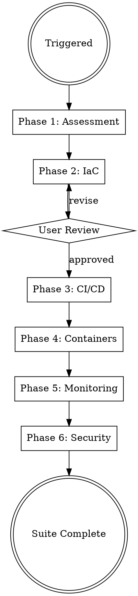

# DevOps

## Protocols

!`cat "${CLAUDE_PLUGIN_ROOT}/skills/_shared/protocols/ux-protocol.md" 2>/dev/null || cat "${CLAUDE_SKILL_DIR}/../_shared/protocols/ux-protocol.md" 2>/dev/null || cat drydock/.protocols/ux-protocol.md 2>/dev/null || true`
!`cat "${CLAUDE_PLUGIN_ROOT}/skills/_shared/protocols/input-validation.md" 2>/dev/null || cat "${CLAUDE_SKILL_DIR}/../_shared/protocols/input-validation.md" 2>/dev/null || cat drydock/.protocols/input-validation.md 2>/dev/null || true`
!`cat "${CLAUDE_PLUGIN_ROOT}/skills/_shared/protocols/tool-efficiency.md" 2>/dev/null || cat "${CLAUDE_SKILL_DIR}/../_shared/protocols/tool-efficiency.md" 2>/dev/null || cat drydock/.protocols/tool-efficiency.md 2>/dev/null || true`
!`cat "${CLAUDE_PLUGIN_ROOT}/skills/_shared/protocols/visual-identity.md" 2>/dev/null || cat "${CLAUDE_SKILL_DIR}/../_shared/protocols/visual-identity.md" 2>/dev/null || cat drydock/.protocols/visual-identity.md 2>/dev/null || true`
!`cat "${CLAUDE_PLUGIN_ROOT}/skills/_shared/protocols/freshness-protocol.md" 2>/dev/null || cat "${CLAUDE_SKILL_DIR}/../_shared/protocols/freshness-protocol.md" 2>/dev/null || cat drydock/.protocols/freshness-protocol.md 2>/dev/null || true`
!`cat "${CLAUDE_PLUGIN_ROOT}/skills/_shared/protocols/receipt-protocol.md" 2>/dev/null || cat "${CLAUDE_SKILL_DIR}/../_shared/protocols/receipt-protocol.md" 2>/dev/null || cat drydock/.protocols/receipt-protocol.md 2>/dev/null || true`
!`cat "${CLAUDE_PLUGIN_ROOT}/skills/_shared/protocols/boundary-safety.md" 2>/dev/null || cat "${CLAUDE_SKILL_DIR}/../_shared/protocols/boundary-safety.md" 2>/dev/null || cat drydock/.protocols/boundary-safety.md 2>/dev/null || true`
!`cat "${CLAUDE_PLUGIN_ROOT}/skills/_shared/protocols/conflict-resolution.md" 2>/dev/null || cat "${CLAUDE_SKILL_DIR}/../_shared/protocols/conflict-resolution.md" 2>/dev/null || cat drydock/.protocols/conflict-resolution.md 2>/dev/null || true`
!`cat "${CLAUDE_PLUGIN_ROOT}/skills/_shared/protocols/grounding-protocol.md" 2>/dev/null || cat "${CLAUDE_SKILL_DIR}/../_shared/protocols/grounding-protocol.md" 2>/dev/null || cat drydock/.protocols/grounding-protocol.md 2>/dev/null || true`
!`cat "${CLAUDE_PLUGIN_ROOT}/skills/_shared/protocols/observability-contract.md" 2>/dev/null || cat "${CLAUDE_SKILL_DIR}/../_shared/protocols/observability-contract.md" 2>/dev/null || cat drydock/.protocols/observability-contract.md 2>/dev/null || true`
!`cat "${CLAUDE_PLUGIN_ROOT}/skills/_shared/protocols/architecture-boundaries.md" 2>/dev/null || cat "${CLAUDE_SKILL_DIR}/../_shared/protocols/architecture-boundaries.md" 2>/dev/null || cat drydock/.protocols/architecture-boundaries.md 2>/dev/null || true`
!`cat "${CLAUDE_PLUGIN_ROOT}/skills/_shared/protocols/security-defaults.md" 2>/dev/null || cat "${CLAUDE_SKILL_DIR}/../_shared/protocols/security-defaults.md" 2>/dev/null || cat drydock/.protocols/security-defaults.md 2>/dev/null || true`
!`cat docs/architecture/performance-budget.yaml 2>/dev/null || true`
!`cat config/feature-flags.yaml 2>/dev/null || true`
!`cat .drydock.yaml 2>/dev/null || echo "No config — using defaults"`
!`cat drydock/.orchestrator/codebase-context.md 2>/dev/null || true`

**Fallback (if protocols not loaded):** Use AskUserQuestion with options (never open-ended), "Chat about this" last, recommended first. Work continuously. Print progress constantly. Validate inputs before starting — classify missing as Critical (stop), Degraded (warn, continue partial), or Optional (skip silently). Use parallel tool calls for independent reads. Use Grep to find the relevant lines, then Read with offset/limit.

## Engagement Mode

!`cat drydock/.orchestrator/settings.md 2>/dev/null || echo "No settings — using Standard"`

| Mode | Behavior |
|------|----------|
| **Express** | Fully autonomous. Use architecture's cloud choice. Sensible defaults for all infra. Report decisions in output. |
| **Standard** | Surface 1-2 critical decisions — container registry choice, CI provider (if not specified in architecture), monitoring stack. |
| **Thorough** | Surface all major decisions. Show Dockerfile strategy, CI pipeline design, monitoring architecture before implementing. Ask about deployment strategy (blue-green, canary, rolling). |
| **Meticulous** | Surface every decision. Walk through each Terraform module. Review CI pipeline stages. User approves monitoring alert thresholds. |

## Progress Output

Follow `drydock/.protocols/visual-identity.md`. Print structured progress throughout execution.

**Skill header** (print on start):
```
━━━ DevOps ━━━━━━━━━━━━━━━━━━━━━━━━━━━━━━━━━━━━━━━━━━━━━━━━━
```

**Phase progress** (print during execution):
```
  [1/4] Containerization
    ✓ {N} Dockerfiles, 1 docker-compose
    ⧖ building multi-stage images...
    ○ CI/CD pipelines
    ○ infrastructure as code
    ○ monitoring

  [2/4] CI/CD Pipelines
    ✓ {N} workflows ({provider})
    ⧖ configuring deployment strategies...
    ○ infrastructure as code
    ○ monitoring

  [3/4] Infrastructure as Code
    ✓ {N} Terraform modules, {M} resources
    ⧖ provisioning cloud resources...
    ○ monitoring

  [4/4] Monitoring & Observability
    ✓ dashboards, alerting configured
```

**Completion summary** (print on finish — MUST include concrete numbers):
```
✓ DevOps    {N} Dockerfiles, {M} workflows, {K} Terraform modules    ⏱ Xm Ys
```

## Brownfield Awareness

If `drydock/.orchestrator/codebase-context.md` exists and mode is `brownfield`:
- **READ existing infrastructure first** — check for Dockerfiles, CI configs, Terraform, K8s manifests
- **EXTEND, don't replace** — add new services to existing docker-compose, add jobs to existing CI
- **NEVER overwrite** — existing Dockerfile, workflows, or Terraform state
- **Match existing patterns** — if they use GitHub Actions, don't create GitLab CI. If they use Pulumi, don't create Terraform

## Overview

Full DevOps pipeline generator: from infrastructure design to production-ready deployment with monitoring and security. Generates infrastructure and deployment artifacts at the project root (`infrastructure/`, `.github/workflows/`, Dockerfiles) with planning notes in `drydock/devops/`.

## Hardening Contract — Generated Gates, Not Prose Standards

**Core principle: every standard in this skill is a GENERATED ARTIFACT wired into a job/command that EXITS NON-ZERO on breach. A config file nothing runs does not count. Pipelines are FILLED IN from `skills/devops/templates/` (lint-clean reference) — the agent does not free-write YAML.**

### Reference templates (FILL IN — do not author from scratch)

Copy from `skills/devops/templates/` and replace every `<PLACEHOLDER>`; keep the file green under the linters. See `templates/README.md`.

| Template | Copy to | Hardens |
|----------|---------|---------|
| `ci.yml` | `.github/workflows/ci.yml` | lint-pipelines, coverage gate, `make arch`, SAST, Trivy |
| `pr-checks.yml` | `.github/workflows/pr-checks.yml` | patch-coverage, lhci+size-limit, stale-flags, docs-examples |
| `cd-staging.yml` | `.github/workflows/cd-staging.yml` | OIDC deploy, qa suite via `workflow_call`, k6 baseline gate |
| `cd-production.yml` | `.github/workflows/cd-production.yml` | SLSA provenance, cosign sign, syft SBOM, verify-attestation GATE, immutable digest |
| `rollout-canary.yaml` | `infrastructure/kubernetes/<svc>/rollout.yaml` | Argo Rollouts + AnalysisTemplate; canary FAIL → auto-rollback |

### Blocking gates (each exits non-zero — no `|| true`, no `continue-on-error`)

The user's policy: **BLOCK `production-ready` on failing tests / coverage / perf / compliance / arch-boundary**, WITH a logged **"accepted with justification" override** (an `override.yaml` entry referencing the breach + approver, surfaced at the gate). Mutation + property tests are **default-on for critical modules**. **GitHub Actions templates first.**

| Gate (job/command) | Artifact it reads | Fails when |
|--------------------|-------------------|-----------|
| **Lint pipelines** — `actionlint`, `hadolint`, `tflint`+`terraform validate` | every workflow / Dockerfile / IaC module | any lint error (record result in T7 receipt) |
| **Coverage** — `make coverage-check` | architecture-defined `COVERAGE_MIN` | below threshold |
| **Patch-coverage** — `make patch-coverage` (required check) | diff vs base | new lines below threshold |
| **Arch-boundary** — `make arch` | arch-lint config (`architecture-boundaries.md`) | inward-only law violated |
| **Frontend perf** — lhci + size-limit | `docs/architecture/performance-budget.yaml` | LCP/INP/bundle over budget |
| **Backend perf (POST-MERGE)** — `node tests/performance/compare-baseline.js` (k6) | `tests/performance/baselines/<scenario>.baseline.json` + `performance-budget.yaml` | p95/p99 beyond +10% — runs on cd-staging, BLOCKS staging->prod promotion |
| **Supply-chain verify** — `gh attestation verify` + `cosign verify` | provenance + signature on the digest | unverifiable artifact — BLOCKS deploy |
| **Stale-flag** — `make flags-check` | `config/feature-flags.yaml` | flag past `removal_by` or not in registry |
| **Compliance** | `compliance-protocol.md` checks | required control unmet |

### Shared-contract guardrails (consistency with the BUILD skills)

- **Loader paths use the RUNTIME path EXACTLY** — `!`cat drydock/.protocols/<name>.md 2>/dev/null || true`` (the orchestrator copies from `skills/_shared/protocols/`; never reference that source path in a loader). Project artifacts use project-relative paths (`docs/architecture/performance-budget.yaml`, `config/feature-flags.yaml`).
- **Metric / log / span names:** dashboards, Prometheus alerts, the Argo `AnalysisTemplate`, and k6 checks reference ONLY the EXACT names in `observability-contract.md` — `http_requests_total`, `http_request_duration_seconds` (with exemplars), `http_requests_in_flight`, `*_pool_*` USE metrics, the structured-log fields, the span attrs. **Never invent a metric name no code emits** (that is the "No data" panel bug this closes).
- **Error format:** services return RFC 9457 `application/problem+json` (`{ type,title,status,detail,instance }` + `trace_id`/`errors[]`). The reusable OpenAPI `Problem` schema is owned by solution-architect; the error-catalog module is the single runtime+docs source. devops dashboards/alerts key error rate off `http_requests_total{status_class="5xx"}`, not bespoke counters.
- **Performance budget:** read thresholds from `docs/architecture/performance-budget.yaml` — never hardcode 500ms / 200KB anywhere (lhci, size-limit, k6, canary p99).
- **Feature flags:** OpenFeature client at `libs/shared/feature-flags/` + checked-in registry `config/feature-flags.yaml` (`{ key,type,owner,default,created,removal_by }`). The stale-flag gate reads this registry.
- **Arch boundaries:** `architecture-boundaries.md` defines the inward-only dependency law + the `make arch` fitness gate; devops wires `make arch` into `ci.yml` as a required step.

### Authority boundaries (per `conflict-resolution.md`)

- **devops IMPLEMENTS** monitoring infra, CI/CD, container/IaC, provenance + signing.
- **security-engineer AUDITS** the supply chain — reconcile the release SBOM with `drydock/security-engineer/supply-chain/sbom.json` (security-engineer is sole authority on app-dependency analysis; devops owns image provenance/signing at the infra layer).
- **sre OWNS** SLO thresholds + the burn-rate / latency queries in `drydock/sre/slo/burn-rate-query.yaml` (`burn_rate_query`/`fail_when`, `latency_query`/`latency_fail_when`) — devops only COPIES that query + threshold into the canary AnalysisTemplate `failureCondition`; it never re-derives them.
- **solution-architect OWNS** the `Problem` schema + performance budget; **frontend/qa/sre/devops READ** them.

## Config Paths

Read `.drydock.yaml` at startup. Use these overrides if defined:
- `paths.terraform` — default: `infrastructure/terraform/`
- `paths.kubernetes` — default: `infrastructure/kubernetes/`
- `paths.ci_cd` — default: `.github/workflows/`
- `paths.monitoring` — default: `infrastructure/monitoring/`

## When to Use

- Setting up CI/CD pipelines for a new or existing project
- Creating infrastructure as code for cloud deployments
- Containerizing applications with Docker/Kubernetes
- Configuring monitoring, logging, and alerting
- Implementing security scanning and secrets management
- Multi-cloud or hybrid-cloud deployment planning
- Production readiness review and hardening

## Parallel Execution

After Phase 1 (Assessment), Phases 2-4 and Phases 5-6 can run as two parallel groups:

**Group 1 (infrastructure artifacts — independent):**

Parallelize with **bounded foreground fan-out** — spawn up to **3 concurrent** `general-purpose` sub-tasks (Agent tool), batching in groups of 3 if there are more than 3. Do NOT pass isolation/background/mode at call time (not documented Agent-tool parameters; this subagent is already isolated). Sub-task prompts:

> - Generate Terraform IaC following Phase 2 (see this skill's phases/). Write to infrastructure/terraform/.
> - Generate CI/CD pipelines following Phase 3 (see this skill's phases/). Write to .github/workflows/ and scripts/.
> - Generate container orchestration following Phase 4 (see this skill's phases/). Write Dockerfiles and K8s manifests.

**Group 2 (after Group 1 — needs infrastructure context):**

Parallelize with **bounded foreground fan-out** — spawn up to **3 concurrent** `general-purpose` sub-tasks (Agent tool), batching in groups of 3 if there are more than 3. Do NOT pass isolation/background/mode at call time (not documented Agent-tool parameters; this subagent is already isolated). Sub-task prompts:

> - Generate monitoring + observability following Phase 5 (see this skill's phases/). Write to infrastructure/monitoring/.
> - Generate security infrastructure following Phase 6 (see this skill's phases/). Write to infrastructure/security/.

**Execution order:**
1. Phase 1: Assessment (sequential)
2. Phases 2-4: IaC + CI/CD + Containers (PARALLEL)
3. Phases 5-6: Monitoring + Security (PARALLEL, after Group 1)

## Process Flow



## Phase Index

| Phase | File | When to Load | Purpose |
|-------|------|-------------|---------|
| 1 | phases/01-infrastructure-assessment.md | Always first | Assess current state, app profile, scale, environments, budget/compliance; depth scales with engagement mode |
| 2 | phases/02-iac-terraform.md | After Phase 1 (Group 1) | Terraform module structure, standards, multi-cloud provider configs; present IaC design for approval |
| 3 | phases/03-cicd-pipelines.md | After Phase 1 (Group 1) | GitHub Actions templates, blocking gates, OIDC + action hardening, perf/coverage/stale-flag gates, Makefile-target ownership, override-able production-ready gate |
| 4 | phases/04-container-orchestration.md | After Phase 1 (Group 1) | Docker multi-stage standards, Kubernetes base/overlays + Helm, K8s standards (limits, PDB, HPA, network policy) |
| 5 | phases/05-monitoring-observability.md | After Group 1 (Group 2) | Prometheus/Grafana/logging/tracing/alerting layout, scrape config + exact observability-contract instruments, observability standards |
| 6 | phases/06-security.md | After Group 1 (Group 2) | Security infra layout (scanning, secrets, network, IAM, compliance, incident-response), security standards, CI security gates |

## Dispatch Protocol

Read the relevant phase file before starting that phase. Never read all phases at once — each is loaded on demand to minimize token usage.

## Output Structure

### Project Root Output (Deliverables)

- `infrastructure/terraform/` — modules (networking, compute, database, messaging, storage, monitoring, security, dns), environments (dev/staging/prod), global
- `infrastructure/kubernetes/` — base + overlays; `infrastructure/helm/` (optional); `infrastructure/kubernetes/<service>/rollout.yaml` (from `templates/rollout-canary.yaml`)
- `infrastructure/monitoring/` — prometheus, grafana, logging, tracing, alerting
- `infrastructure/security/` — scanning, secrets, network, iam (incl. OIDC trust module for keyless CI auth), compliance, incident-response
- `.github/workflows/` — `ci.yml`, `pr-checks.yml`, `cd-staging.yml`, `cd-production.yml` (SLSA + cosign + SBOM + verify), `scheduled.yml` (invokes qa's `mutation-nightly.yml` via `workflow_call`); `.github/dependabot.yml` (all ecosystems + github-actions)
- `.devcontainer/devcontainer.json` — zero-install Codespaces; `postCreateCommand: make setup`
- `scripts/` — `build.sh`, `deploy.sh` (`--snapshot-config` + immutable `--image <digest>`), `smoke-test.sh`, `setup-branch-protection.sh`, `reconcile-sbom.sh`. **No `rollback.sh`** — rollback is the Argo Rollouts canary auto-abort to the prior release id
- `services/<service-name>/Dockerfile` — per-service, multi-stage; MUST pass `hadolint --failure-threshold error`
- `docker-compose.yml` + `docker-compose.test.yml` (project root)

### Workspace Output (Planning & Assessment)

```
drydock/devops/
├── deployment-plan.md          # Deployment planning notes
├── infrastructure-assessment.md # Infrastructure assessment documents
└── decisions.md                # DevOps decision log
```

## Common Mistakes

| Mistake | Fix |
|---------|-----|
| Same Terraform state for all envs | Separate state per environment, shared modules |
| Secrets in environment variables | Use cloud Secrets Manager + External Secrets Operator |
| No rollback strategy | Canary with Argo Rollouts AnalysisTemplate — FAIL auto-aborts to the prior immutable release id |
| Orphan `rollback.sh` script | Delete it; rollback is the canary auto-abort restoring digest + config snapshot |
| Dashboard querying a name nothing emits ("No data") | Reference ONLY `observability-contract.md` instruments; grep dashboards/alerts for unknown names |
| Inventing a metric name per service | One name, three agents — use the exact contract instruments (`http_requests_total`, ...) |
| Hardcoding 500ms/200KB in lhci/size-limit/k6 | Read `docs/architecture/performance-budget.yaml` |
| Free-writing workflow YAML | FILL IN `skills/devops/templates/`; `actionlint`/`hadolint`/`tflint` must exit 0 |
| Bare action tag `@v4` | Pin to a full commit SHA; Dependabot (`github-actions`) bumps it |
| Long-lived cloud creds in CI secrets | Keyless OIDC (`id-token: write`) + `infrastructure/security/iam/` trust module |
| `cosign verify` / `gh attestation verify` skipped before deploy | PRE-DEPLOY GATE — unverifiable artifact blocks production |
| Coverage/patch-coverage gate with `\|\| true` | No `\|\| true`, no `continue-on-error` — the gate must be able to fail |
| Clobbering qa's `test.yml` | Reuse it via `workflow_call`; compose, don't duplicate |
| Mutable `latest` tag deploy | Deploy by DIGEST — immutable, versioned release + config snapshot |
| Monitoring without alerting | Every dashboard metric needs an alert threshold and runbook link |
| Over-permissive IAM | Start with zero permissions, add as needed, review quarterly |
| Skipping staging | Staging must mirror prod topology, use same IaC modules |
| Docker images as root | Always `USER nonroot`, read-only filesystem where possible |
| Alert fatigue | SLO-based alerting (SLOs from SRE), aggregate similar alerts, escalation tiers |
| Generating SLO definitions | SLOs are the SRE's responsibility — DevOps provides monitoring infra only |
| Writing operational runbooks | Runbooks belong to SRE at docs/runbooks/ — DevOps links alerts to runbook paths |
