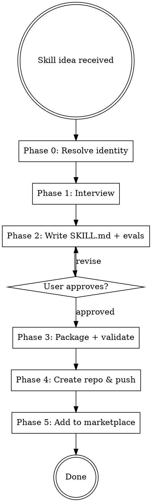

# Skill Maker

## Protocols

!`bash "${CLAUDE_SKILL_DIR}/../_shared/load-protocol.sh" ux-protocol`
!`bash "${CLAUDE_SKILL_DIR}/../_shared/load-protocol.sh" input-validation`
!`bash "${CLAUDE_SKILL_DIR}/../_shared/load-protocol.sh" tool-efficiency`
!`bash "${CLAUDE_SKILL_DIR}/../_shared/load-protocol.sh" visual-identity`
!`bash "${CLAUDE_SKILL_DIR}/../_shared/load-protocol.sh" freshness-protocol`
!`bash "${CLAUDE_SKILL_DIR}/../_shared/load-protocol.sh" receipt-protocol`
!`bash "${CLAUDE_SKILL_DIR}/../_shared/load-protocol.sh" boundary-safety`
!`bash "${CLAUDE_SKILL_DIR}/../_shared/load-protocol.sh" conflict-resolution`
!`bash "${CLAUDE_SKILL_DIR}/../_shared/load-protocol.sh" grounding-protocol`
!`bash "${CLAUDE_SKILL_DIR}/../_shared/load-file.sh" .drydock.yaml`

**Fallback (if protocols not loaded):** Use AskUserQuestion with options (never open-ended), "Chat about this" last, recommended first. Work continuously. Print progress constantly. Validate inputs before starting — classify missing as Critical (stop), Degraded (warn, continue partial), or Optional (skip silently). Use parallel tool calls for independent reads. Use Grep to find the relevant lines, then Read with offset/limit.

## Progress Output

Follow `drydock/.protocols/visual-identity.md`. Print structured progress throughout execution.

**Skill header** (print on start):
```
━━━ Skill Maker ━━━━━━━━━━━━━━━━━━━━━━━━━━━━━━━━━━━━━━━━━━━━
```

**Phase progress** (print during execution):
```
  [1/3] Pattern Analysis
    ✓ {N} recurring patterns identified
    ⧖ analyzing workflow structure...
    ○ skill generation
    ○ installation

  [2/3] Skill Generation
    ✓ {N} custom skills drafted
    ⧖ writing SKILL.md files...
    ○ installation

  [3/3] Installation
    ✓ {N} skills installed to .claude/skills/
```

**Completion summary** (print on finish — MUST include concrete numbers):
```
✓ Skill Maker    {N} project-specific skills created    ⏱ Xm Ys
```

## Overview

End-to-end skill and plugin creation pipeline. Interviews the user on what the skill should do, writes the SKILL.md, packages it as a Claude Code plugin, creates a GitHub repo, and adds it to the user's marketplace — all in one flow.

## Config Paths

Read `.drydock.yaml` at startup if available. Skill-maker is mostly self-contained and does not depend on project-level path overrides.

## When to Use

- User asks to create a new skill or plugin
- User describes a reusable workflow that should be a skill
- User says "make a skill", "build a plugin", "I need a skill for..."
- NOT for: editing existing skills (just edit the file directly)

## Process Flow



## Phase 0: Resolve Identity (Runtime — never hardcode)

Derive the owner/handle and marketplace/repo names from the user's environment at runtime. NEVER hardcode a specific person's handle, repo, or local path.

Resolve `<owner>` (GitHub handle) in this order, using the first that succeeds:
1. `gh api user --jq .login` — the authenticated GitHub login (preferred)
2. Parse the origin remote: `git config --get remote.origin.url` → extract the owner segment (e.g. `github.com:<owner>/<repo>` or `github.com/<owner>/<repo>`)
3. `git config user.name` — fallback display name
4. If all fail, ask the user via AskUserQuestion.

Derive the other values from `<owner>` (confirm/override with the user when unsure):
- `<marketplace-repo>`: the user's marketplace repo (e.g. `<owner>/claude-code-plugins`). If `.drydock.yaml` or an existing marketplace is detected, use that instead.
- Plugin repo: `<owner>/<skill-name>-plugin`
- Marketplace local path: derive from where the marketplace is cloned, or default to a temp clone — do not assume a fixed `~/...` path.

Use these resolved variables everywhere below (`<owner>`, `<marketplace-repo>`); any literal handle/repo/path in templates is a placeholder only and must be replaced at runtime.

## Phase 1: Interview (Quick)

**Autonomy level determines interview depth:**
- **Autopilot**: Infer all answers from the project context and agent prompts. Skip interview entirely. Report inferences.
- **Copilot**: Ask 1-2 key questions (purpose + trigger conditions). Auto-resolve the rest.
- **Checkpoint/Manual**: Ask 3-4 questions using AskUserQuestion, one at a time:

1. **What does this skill do?** — Core purpose in one sentence
2. **When should it trigger?** — Specific words, patterns, or situations
3. **What's the workflow?** — Steps the skill should follow (linear, loop, decision tree?)
4. **Skill type?** — Options: Technique (steps to follow), Pattern (mental model), Reference (docs/API guide), Workflow (multi-phase process)

## Phase 2: Write SKILL.md

Follow these rules from the writing-skills methodology:

**Frontmatter:**
- `name`: kebab-case, letters/numbers/hyphens only
- `description`: max 1024 chars, written in THIRD PERSON, must include BOTH what the skill does AND when to use it. Format: `[what it does]. Use when [triggering conditions].` Omitting either half (no "what", or no "when") hurts discoverability.
- `disable-model-invocation: true` (optional): set on side-effecting/destructive generated skills so Claude will NOT auto-invoke them — they then run only when the user explicitly calls them. Use for anything that deletes, deploys, pushes, or otherwise mutates state.
- `allowed-tools` (optional): scope and pre-approve the exact tools the skill needs (e.g. `Read, Grep, Bash`). Narrowing this both restricts the skill and reduces permission prompts.

**Structure:**
```markdown
---
name: skill-name
description: [what it does]. Use when [triggering conditions].
# Optional, for generated skills that mutate state:
# disable-model-invocation: true
# allowed-tools: Read, Grep, Bash
---

# Skill Name

## Overview
Core principle in 1-2 sentences.

## When to Use
Bullet list with symptoms and use cases.

## Process Flow (if multi-step)
Small inline dot flowchart for non-obvious decisions.

## [Core Content]
Steps, patterns, or reference material.

## Common Mistakes
Table of mistake -> fix pairs.
```

**Quality rules:**
- One excellent example beats many mediocre ones
- Flowcharts ONLY for non-obvious decision points
- Keep the SKILL.md **body under ~500 LINES**. Use **progressive disclosure**: keep SKILL.md as a concise overview + entry point, and move detailed content into one-level-deep reference files (e.g. `reference.md`, `examples.md`) and `scripts/` that Claude loads on demand. Point to them from SKILL.md (e.g. "See `reference.md` for the full API"). Claude reads these only when needed, keeping the always-loaded context small.
- **Scripts over prose**: for fragile or deterministic operations (parsing, validation, multi-step shell sequences, anything error-prone to re-derive from text), bundle a script in a `scripts/` dir and have the skill CALL it, rather than describing the steps in prose for Claude to reconstruct each time. Reserve prose for judgment and explanation; push determinism into code.
- Use active voice, verb-first naming
- Include keywords for discoverability (error messages, symptoms, tool names)

**Generate an evals set (always):** Alongside every generated skill, write a small evals file (`skills/<skill-name>/evals/evals.md`, or `.yaml`) with **at least 3 positive and 3 negative cases** covering:
- **Trigger cases** — prompts that SHOULD invoke the skill (positive) and similar-looking prompts that should NOT (negative), to validate the `description`.
- **Behaviour cases** — given the skill is loaded, the expected output/action (positive) and a known failure/wrong path the skill must avoid (negative).

Each case lists: input prompt → expected trigger (yes/no) → expected behaviour/assertion. Keep them concrete so they can be replayed by hand or by a harness.

**Skill review (autonomy-level-aware):** Autopilot — proceed to packaging, report skill summary. Copilot — present brief summary for approval. Checkpoint/Manual — present full SKILL.md for detailed review via AskUserQuestion.

## Phase 3: Package as Plugin

Create the plugin directory structure:

```
<skill-name>-plugin/
├── .claude-plugin/
│   └── plugin.json
├── skills/
│   └── <skill-name>/
│       ├── SKILL.md          # concise entry point (< ~500 lines)
│       ├── reference.md      # optional, loaded on demand (progressive disclosure)
│       ├── examples.md       # optional, loaded on demand
│       ├── scripts/          # optional, deterministic ops the skill calls
│       └── evals/            # trigger/behaviour test cases (see below)
└── README.md
```

Only create `reference.md`, `examples.md`, and `scripts/` when the content warrants splitting out — don't manufacture empty files.

**plugin.json template:**
```json
{
  "name": "<skill-name>",
  "description": "<one-line description>",
  "version": "1.0.0",
  "author": {
    "name": "<from git config or ask>"
  },
  "license": "MIT",
  "keywords": ["<relevant>", "<tags>"]
}
```

**README.md template:**
```markdown
# <Skill Name> Plugin for Claude Code

<description>

## Installation

### Via Marketplace
/plugin marketplace add <marketplace-repo>
/plugin install <skill-name>@<owner>

### Load Directly
claude --plugin-dir /path/to/<skill-name>-plugin

## Usage
<trigger description and examples>

## License
MIT
```

**Validate before shipping:** run `claude plugin validate <path-to-plugin-dir>` and fix any reported errors (frontmatter, manifest, structure) before pushing. Treat a clean validate as a gate for Phase 4.

## Phase 4: Create Repo & Push

1. `git init` in the plugin directory
2. `git add -A && git commit -m "Initial release: <skill-name> plugin v1.0.0"`
3. `gh repo create <skill-name>-plugin --public --source . --push`
4. If `gh` auth fails, guide user through `gh auth login`

## Phase 5: Add to Marketplace

1. Read the user's marketplace repo (`<marketplace-repo>`, resolved in Phase 0)
2. Clone or locate the marketplace locally
3. Add new plugin entry to `.claude-plugin/marketplace.json`:
   ```json
   {
     "name": "<skill-name>",
     "source": {
       "source": "github",
       "repo": "<owner>/<skill-name>-plugin"
     },
     "description": "<description>",
     "version": "1.0.0"
   }
   ```
4. Update README.md plugin table
5. Commit and push marketplace repo
6. Report final install command: `/plugin install <skill-name>@<owner>`

## Marketplace Config

All identity values are **resolved at runtime in Phase 0** — never hardcode a specific person.

- **Marketplace repo:** `<marketplace-repo>` (default `<owner>/claude-code-plugins`, where `<owner>` is the detected handle)
- **Marketplace local path:** wherever the marketplace is cloned; otherwise a temp clone — do not assume a fixed `~/...` path
- **Plugin location:** the working/plugin directory for `<skill-name>-plugin`

If the user has a different marketplace, ask which one to use.

## Common Mistakes

| Mistake | Fix |
|---------|-----|
| Description omits what the skill does OR when to use it | Include BOTH, third person, ≤1024 chars: "[what it does]. Use when [triggers]." |
| Special chars in name | Letters, numbers, hyphens only. No parentheses. |
| Everything crammed into SKILL.md | Keep body < ~500 lines; use progressive disclosure — split into reference.md / examples.md / scripts/ loaded on demand. |
| Re-deriving fragile/deterministic steps in prose | Bundle them as a script in scripts/ and call it. |
| Side-effecting skill auto-runs unexpectedly | Set `disable-model-invocation: true` so it runs only on explicit user request. |
| Missing keywords for discovery | Add error messages, symptoms, tool names in the content |
| No evals shipped | Generate ≥3 positive + ≥3 negative trigger/behaviour cases under evals/. |
| Skipping validation | Run `claude plugin validate` before pushing. |
| Hardcoding a person's handle/repo/path | Resolve `<owner>`/`<marketplace-repo>` at runtime (Phase 0). |
| Forgetting to update marketplace | Always add to marketplace.json AND push |
| Plugin files inside .claude-plugin/ | Only plugin.json goes in .claude-plugin/. Skills at root level. |
