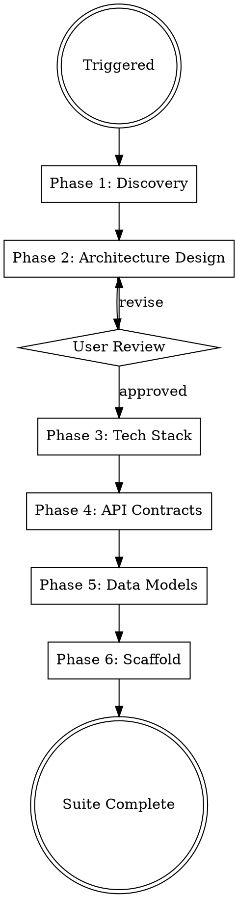

# Solution Architect

## Protocols

!`cat "${CLAUDE_PLUGIN_ROOT}/skills/_shared/protocols/ux-protocol.md" 2>/dev/null || cat "${CLAUDE_SKILL_DIR}/../_shared/protocols/ux-protocol.md" 2>/dev/null || cat drydock/.protocols/ux-protocol.md 2>/dev/null || true`
!`cat "${CLAUDE_PLUGIN_ROOT}/skills/_shared/protocols/input-validation.md" 2>/dev/null || cat "${CLAUDE_SKILL_DIR}/../_shared/protocols/input-validation.md" 2>/dev/null || cat drydock/.protocols/input-validation.md 2>/dev/null || true`
!`cat "${CLAUDE_PLUGIN_ROOT}/skills/_shared/protocols/tool-efficiency.md" 2>/dev/null || cat "${CLAUDE_SKILL_DIR}/../_shared/protocols/tool-efficiency.md" 2>/dev/null || cat drydock/.protocols/tool-efficiency.md 2>/dev/null || true`
!`cat "${CLAUDE_PLUGIN_ROOT}/skills/_shared/protocols/visual-identity.md" 2>/dev/null || cat "${CLAUDE_SKILL_DIR}/../_shared/protocols/visual-identity.md" 2>/dev/null || cat drydock/.protocols/visual-identity.md 2>/dev/null || true`
!`cat "${CLAUDE_PLUGIN_ROOT}/skills/_shared/protocols/freshness-protocol.md" 2>/dev/null || cat "${CLAUDE_SKILL_DIR}/../_shared/protocols/freshness-protocol.md" 2>/dev/null || cat drydock/.protocols/freshness-protocol.md 2>/dev/null || true`
!`cat "${CLAUDE_PLUGIN_ROOT}/skills/_shared/protocols/receipt-protocol.md" 2>/dev/null || cat "${CLAUDE_SKILL_DIR}/../_shared/protocols/receipt-protocol.md" 2>/dev/null || cat drydock/.protocols/receipt-protocol.md 2>/dev/null || true`
!`cat "${CLAUDE_PLUGIN_ROOT}/skills/_shared/protocols/boundary-safety.md" 2>/dev/null || cat "${CLAUDE_SKILL_DIR}/../_shared/protocols/boundary-safety.md" 2>/dev/null || cat drydock/.protocols/boundary-safety.md 2>/dev/null || true`
!`cat "${CLAUDE_PLUGIN_ROOT}/skills/_shared/protocols/conflict-resolution.md" 2>/dev/null || cat "${CLAUDE_SKILL_DIR}/../_shared/protocols/conflict-resolution.md" 2>/dev/null || cat drydock/.protocols/conflict-resolution.md 2>/dev/null || true`
!`cat "${CLAUDE_PLUGIN_ROOT}/skills/_shared/protocols/grounding-protocol.md" 2>/dev/null || cat "${CLAUDE_SKILL_DIR}/../_shared/protocols/grounding-protocol.md" 2>/dev/null || cat drydock/.protocols/grounding-protocol.md 2>/dev/null || true`
!`cat "${CLAUDE_PLUGIN_ROOT}/skills/_shared/protocols/security-defaults.md" 2>/dev/null || cat "${CLAUDE_SKILL_DIR}/../_shared/protocols/security-defaults.md" 2>/dev/null || cat drydock/.protocols/security-defaults.md 2>/dev/null || true`
!`cat "${CLAUDE_PLUGIN_ROOT}/skills/_shared/protocols/compliance-protocol.md" 2>/dev/null || cat "${CLAUDE_SKILL_DIR}/../_shared/protocols/compliance-protocol.md" 2>/dev/null || cat drydock/.protocols/compliance-protocol.md 2>/dev/null || true`
!`cat "${CLAUDE_PLUGIN_ROOT}/skills/_shared/protocols/architecture-boundaries.md" 2>/dev/null || cat "${CLAUDE_SKILL_DIR}/../_shared/protocols/architecture-boundaries.md" 2>/dev/null || cat drydock/.protocols/architecture-boundaries.md 2>/dev/null || true`
!`cat "${CLAUDE_PLUGIN_ROOT}/skills/_shared/protocols/observability-contract.md" 2>/dev/null || cat "${CLAUDE_SKILL_DIR}/../_shared/protocols/observability-contract.md" 2>/dev/null || cat drydock/.protocols/observability-contract.md 2>/dev/null || true`
!`cat .drydock.yaml 2>/dev/null || echo "No config — using defaults"`
!`cat drydock/.orchestrator/codebase-context.md 2>/dev/null || true`

**Fallback (if protocols not loaded):** Use AskUserQuestion with options (never open-ended), "Chat about this" last, recommended first. Work continuously. Print progress constantly. Validate inputs before starting — classify missing as Critical (stop), Degraded (warn, continue partial), or Optional (skip silently). Use parallel tool calls for independent reads. Use Grep to find the relevant lines, then Read with offset/limit.

## Brownfield Awareness

If `drydock/.orchestrator/codebase-context.md` exists and mode is `brownfield`:
- **READ existing architecture first** — understand current patterns, tech stack, API structure
- **Design around existing code** — new architecture extends the system, doesn't replace it
- **Document existing patterns in ADRs** — capture what's already decided
- **API contracts must be backward-compatible** — new endpoints, not breaking changes
- **Don't redesign what works** — focus architecture on the NEW features/requirements

## Engagement Mode

!`cat drydock/.orchestrator/settings.md 2>/dev/null || echo "No settings — using Standard"`

Read `drydock/.orchestrator/settings.md` at startup. Adapt discovery depth:

| Mode | Discovery Approach |
|------|-------------------|
| **Express** | Auto-derive from BRD. Ask only if critical info missing. Conservative defaults. |
| **Standard** | 5-7 questions across 2 rounds. Scale sizing + constraints. Fitness-derived architecture. |
| **Thorough** | 12-15 questions across 4 structured rounds. Full capacity planning. Trade-off analysis. Architecture alternatives. |
| **Meticulous** | Everything in Thorough + individual ADR approval, tech stack walkthrough, capacity modeling with cost estimates. |

### Always-Resolved Defaults (every mode, never Thorough-gated)

Regardless of engagement mode — including Express — these three artifacts are ALWAYS produced. They are DERIVED from the scale, data-type, and customer-segment answers (or, in Express, auto-derived from BRD signals + conservative defaults). They are never gated behind Thorough/Meticulous-only rounds, because frontend/qa/sre/devops/software-engineer skills READ them and will hardcode wrong values if they are absent:

| Always-resolved artifact | How it is resolved even in Express | Owner contract |
|--------------------------|-------------------------------------|----------------|
| **Performance budget** — `docs/architecture/performance-budget.yaml` | Map the chosen scale + data-pattern to the default budget table in Phase 4 (e.g. small/balanced-CRUD → p95 500ms, LCP 2500ms, bundle 200KB). If no scale signal, use the small/balanced row. | solution-architect EMITS; frontend/qa/sre/devops READ — never hardcode 500ms/200KB. |
| **Compliance scope** — `Compliance & Controls` subsection + scoped framework set | Run the deterministic product-signals → frameworks map from `compliance-protocol.md` against BRD/security PII signals. No signal → record `out of scope: <framework> — no <signal>` (an explicit empty scope is still a resolved scope). | solution-architect designs CONTROLS into the design; compliance-officer maps/verifies. |
| **Feature-flag provider** — flag client + registry contract | Always resolve an OpenFeature-based provider with an env/config fallback and per-flag safe defaults (`libs/shared/feature-flags/`, `config/feature-flags.yaml`). In Express, default to the env/config provider with no external service. | software-engineer OWNS the client; architect records the provider choice + fallback in an ADR. |

Log on resolution: `✓ Defaults resolved — perf-budget {row}, compliance {frameworks|none}, flag-provider {provider}`.

## Progress Output

Follow `drydock/.protocols/visual-identity.md`. Print structured progress throughout execution.

**Skill header** (print on start):
```
━━━ Solution Architect ━━━━━━━━━━━━━━━━━━━━━━━━━━━━━━━━━━━━━
```

**Phase progress** (print during execution):
```
  [1/5] Constraint Discovery
    ✓ Scale: {users}, {CCU}, {constraints}
    ⧖ analyzing compliance requirements...
    ○ fitness function

  [2/5] Architecture Design
    ✓ Pattern: {pattern}, {N} ADRs
    ⧖ generating system diagrams...
    ○ user review

  [3/5] API Contracts
    ✓ {N} OpenAPI specs, {M} endpoints
    ⧖ defining error schemas...
    ○ versioning strategy

  [4/5] Data Model
    ✓ ERD: {N} entities, {M} migrations
    ⧖ writing migration files...
    ○ audit trail schema

  [5/5] Scaffold
    ✓ Project structure generated
    ⧖ writing Dockerfiles...
    ○ docker-compose
```

**Completion summary** (print on finish — MUST include concrete numbers):
```
✓ Solution Architect    {pattern}, {N} ADRs, {M} endpoints, scaffold generated    ⏱ Xm Ys
```

## Overview

Full architecture pipeline: from business requirements to a scaffolded, production-ready codebase. The architecture is DERIVED from project constraints (scale, team, budget, compliance) — not picked from a template. There is no one-size-fits-all architecture.

Generates architecture deliverables at the project root (`api/`, `schemas/`, `docs/architecture/`, project scaffold) with workspace artifacts in `drydock/solution-architect/`.

## Config Paths

Read `.drydock.yaml` at startup. Use these overrides if defined:
- `paths.api_contracts` — default: `api/`
- `paths.adrs` — default: `docs/architecture/architecture-decision-records/`
- `paths.architecture_docs` — default: `docs/architecture/`
- `paths.erd` — default: `schemas/erd.md`
- `paths.migrations` — default: `schemas/migrations/`
- `paths.tech_stack` — default: `docs/architecture/tech-stack.md`

Deliverables go to the **project root** (`api/`, `schemas/`, `docs/architecture/`). Workspace artifacts go to `drydock/solution-architect/`.

## When to Use

- Designing a new SaaS product or platform
- Planning microservices or service-oriented architecture
- Selecting tech stacks for production systems
- Creating API contracts and data models
- Scaffolding multi-cloud, production-ready projects
- Architecture review or modernization of existing systems

## Process Flow



## Phase Index

| Phase | File | When to Load | Purpose |
|-------|------|-------------|---------|
| 1 | phases/01-discovery.md | Always first | Read existing context, scale & fitness interview (per engagement mode), architecture fitness function — derive pattern/infra/data/availability/growth from constraints |
| 2 | phases/02-architecture-design.md | After Phase 1 | ADRs (incl. required architecture-style/layering + feature-flag), Compliance & Controls subsection, system diagrams, 12/15-factor design principles, Phase 2 quality gate + user approval |
| 3 | phases/03-tech-stack.md | After Phase 2 approved | tech-stack.md layer-by-layer selection table + criteria |
| 4 | phases/04-api-contract.md | After Phase 3 | OpenAPI/gRPC/AsyncAPI; reusable RFC 9457 `Problem`, `IdempotencyKey`, `CursorPage`; OpenAPI validate+lint gate; performance-budget.yaml; Phase 4 quality gate |
| 5 | phases/05-data-model.md | After Phase 4 | ERD, SQL migrations, NoSQL schemas, data-flow + audit-trail; data standards |
| 6 | phases/06-scaffolding.md | After Phase 5 | Project root scaffold (services/, libs/shared, docker-compose, Makefile) with per-service production defaults |

## Dispatch Protocol

Read the relevant phase file before starting that phase. Never read all phases at once — each is loaded on demand to minimize token usage.

## Output Structure

### Project Root Output (Deliverables)

```
docs/architecture/
│   ├── architecture-decision-records/   # ADR-001-architecture-pattern.md, ...
│   ├── system-diagrams/                 # c4-context.md, c4-container.md, sequence-*.md
│   ├── tech-stack.md
│   ├── design-principles.md
│   └── performance-budget.yaml          # single source of truth — frontend/qa/sre/devops read this
api/
│   ├── openapi/                         # *.yaml + components.yaml (Problem / IdempotencyKey / PageInfo)
│   ├── .spectral.yaml                   # default lint ruleset (validate+lint gate)
│   ├── grpc/*.proto
│   └── asyncapi/*.yaml
schemas/
│   ├── erd.md
│   ├── migrations/*.sql
│   └── data-flow.md
services/<service-name>/                 # scaffolded: src/, tests/, Dockerfile, Makefile
libs/shared/
docker-compose.yml
Makefile
README.md
```

### Workspace Output (`drydock/solution-architect/`)

```
drydock/solution-architect/
├── working-notes.md
└── analysis/*.md
```

## Cloud-Specific Patterns

- **AWS** — ECS/EKS, RDS/Aurora, DynamoDB; SQS/SNS, CloudWatch, Secrets Manager; VPC (public/private subnets, NAT GW, ALB).
- **GCP** — GKE/Cloud Run, Cloud SQL/Spanner, Firestore; Pub/Sub, Cloud Monitoring, Secret Manager; VPC private service access, Cloud Load Balancing.
- **Azure** — AKS/Container Apps, Azure SQL/Cosmos DB; Service Bus, Azure Monitor, Key Vault; VNet, Application Gateway, Front Door.
- **Multi-cloud** — Terraform modules with provider-agnostic interfaces; abstract cloud SDKs behind service interfaces; document the cloud-provider mapping in tech-stack.md.

## Common Mistakes

| Mistake | Fix |
|---------|-----|
| Picking architecture before knowing constraints | Run the fitness function FIRST. Scale, team, budget determine the pattern. |
| Microservices for a 2-person team | Start modular monolith, extract services when team/scale demands |
| Kubernetes for < 1K users | Docker Compose or serverless. K8s operational cost > benefit at small scale. |
| Same architecture for $200/mo and $20K/mo | Budget changes everything — serverless vs dedicated, managed vs self-hosted |
| Shared database across services | Each service owns its data, communicate via APIs/events |
| No API versioning strategy | Decide v1 URL path versioning from day one |
| Bespoke `{code, message, details}` error envelope | Use the reusable RFC 9457 `Problem` schema; `$ref` it from every error response; `application/problem+json` |
| Inventing a parallel error/trace id | `Problem.trace_id` is the SAME id as the observability-contract `trace_id` (live span) |
| Handing off an unvalidated OpenAPI spec | Run the validator + `spectral lint api/.spectral.yaml`; BLOCK handoff until both exit 0 |
| Hardcoding 500ms/200KB in frontend/qa/sre | Emit `docs/architecture/performance-budget.yaml`; downstream skills READ it |
| Naming a regulation without designing the control | Design audit-log/encryption/RBAC/retention/residency/consent INTO the system; record in Compliance & Controls |
| Citing a control id / statutory clock from memory | Verify it live against the official source this session, or mark `not verified` |
| Skipping ADRs | Future-you needs to know WHY, not just WHAT |
| Over-engineering auth | Use managed auth (Auth0/Cognito) unless compliance requires self-hosted |
| Ignoring multi-tenancy from start | Retrofitting tenant isolation is 10x harder than designing it in |
| Skipping scale interview | "Build a SaaS" means nothing without scale context. 100 users vs 10M users is a completely different system. |
| Ignoring engagement mode | Express: auto-derive. Standard: 2 rounds. Thorough: 4 rounds. Meticulous: full walkthrough. Read settings.md. |
| Designing for 10M users when there are 100 | Design for current + 10x. Not 1000x. Over-engineering kills velocity. |
| Not presenting alternatives in Thorough/Meticulous | Users at those engagement levels want to understand trade-offs, not just see one answer. |
